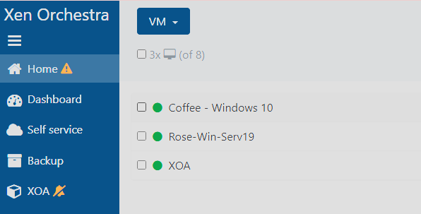
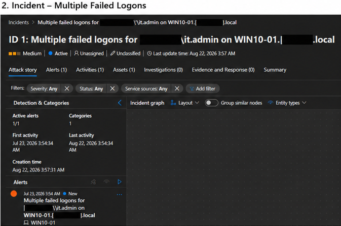
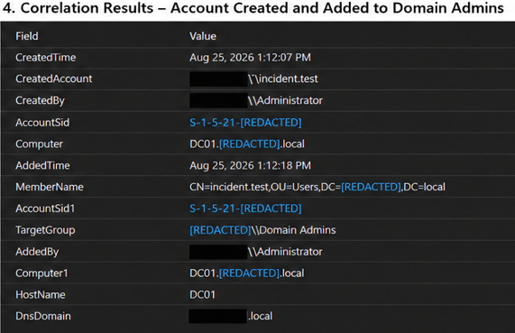

# Microsoft-sentinel-hybrid-lab
Hybrid Microsoft Sentinel security lab for SIEM KQL, detection engineering, and incident response practice.

# Project Overview
This project is my hands-on lab for learning Microsoft Sentinel and getting more experience with security monitoring and incident investigation.

I already have a home lab running on a Dell PowerEdge T630 with XCP-ng, Active Directory, Windows endpoints, Sysmon, and several security tools. Instead of creating a completely separate environment in Azure, I'm connecting my existing lab to Microsoft Sentinel and using it as a simulated business and security testing environment.

The main goals of this project are to:
- Collect and analyze Windows security logs
- Practice writing KQL queries
- Investigate alerts and incidents
- Work with Active Directory security events
- Practice correlating multiple events together
- Build out more realistic attack and investigation scenarios

This lab also supports my preparation for the Blue Team Level 1 (BTL1) exam by giving me hands-on practice with areas such as SIEM investigation, Windows event analysis, incident response, log analysis, and identifying suspicious activity. Instead of only studying the concepts, I  can use this environment to practice them in a working lab.

This repository documents the lab architecture, detection logic, and investigations I complete as I continue building out the environment.

---

## Lab Architecure
### On-Premises Environment

The local lab is hosted on a Dell PowerEdge T630 running XCP-ng with Xen Orchestra for virtualization.
Systems currently used for the Sentinel lab include:

### ROSE - Windows Server 2019
- Active Directory Domain Services
- DNS
- Domain Controller
- Windows Security Event logging
- Azure Arc connected

### COFFEE - Windows 10 
- Domain joined
- Sysmon
- Windows Security Event logging
- Azure Arc connected
- Used as the main endpoint for testing authentication and endpoint activity

This lab network is separate from my main network using OPNsense. Outbound access is restricted and only opened when needed for Azure services and lab testing.

---

## Azure Environment

The Azure side of the lab currently includes:
- Microsoft Sentinel
- Log Analytics Workspace
- Azure Arc
- Azure Monitor Agent
- Windows Security Events
- Data Collection rules

Windows security Events from ROSE and COFFEE are being sent into Sentinel for monitoring and investigation.
Sysmon telemetry from COFFEE is also being collected for additional endpoint visibility.

---

## Technologies Used
- **Microsoft Sentinel** - Microsoft's cloud SIEM used to collect, search, detect, and investigate security activity.
- **KQL** - Query language used to search and analyze logs in Microsoft Sentinel and Log Analytics.
- **Azure Arc** - Connects machines outside of Azure to Azure so they can be managed and monitored.
- **Azure Monitor Agent (AMA)** - Agent installed on system that sends logs and monitoring data to Azure.
- **Log Analytics Workspace** - Central location in Azure where collected log data is stored and queried.
- **Data Collection Rule (DCR)** - Defines what logs Azure Monitor Agent should collect and where to send them.
- **Windows Security Events** - Windows audit logs that record activity such as logons, account changes, and process creation.
- **Active Directory** - Microsoft directory service used to manage domain users, computers, groups, and authentication.
- **Windows Server 2019** - Server operating system used for my domain controller, Active Directory, and DNS.
- **Windows 10** - Domain-joined endpoint used for testing logons, processes, and other security activity.
- **Sysmon** - Windows monitoring tool that provides more detailed endpoint activity than standard Windows logs.
- **XCP-ng** - Hypervisor that runs the virtual machines in my home lab.
- **Xen Orchestra** - Web interface used to manage my XCP-ng virtual machines.
- **OPNsense** - Firewall/router used to separate and control network traffic in the lab.

## Security Monitoring
### Windows Security Events

I configured Windows Security Event collection from both the domain controllers and Windows endpoint.
This gives visibility into activity such as:
- Successful and failed logons
- Process creation
- Account creation and deletion
- Password changes
- Account lockouts
- Privileged logons
- Active Directory group membership changes

## Sysmon
Sysmon is also running on the Windows systems to provide more detailed endpoint telemetry.
I created reusable KQL queries for common Sysmon activity including:
- Process creation
- DNS queries
- File creation
- Network connections
- Registry changes

## Detection & Incident Response
### Multiple Failed Logons
Created a custom Microsoft Sentinel detection for repeated failed authentication attempts against the same account.
The rule monitors Windows Security Event ID 4625 and triggers when an account received five or more failed logons within a five-minute window.
I tested the detection using controlled failed RDP authentication attempts against the COFFEE endpoint. Sentinel generated a Medium-severity incident, which I investigated using Windows authentication events.
The investigation included reviewing:
- Source IP
- Logon type
- Failure reason
- Failed logon count
- Whether a successful authentication followed the attempts.

[View Detection logic](detections/multiple-failed-logons.md)
[View full incident investigation](investigations/investigation-004-failed-rdp-detection.md)

---

### New Account Added to Domain Admins
Created a correlated detection that identified when a newly created Active Directory account is added to the 'Domain Admins' group shortly after creation.
The detection uses:
- Event ID 4720 - Account created
- Event ID 4728 - Member added to a security-enabled global group

The first version of the query correlated events using only the domain controller, which caused duplicated matches.

I improved the rule by correlating the 'TargetSid' from the account creation event with the 'MemberSid' from the Domain Admins event. This made sure the detection was matching the exact same account across both events.

The final rule detects when the same newly created account is added to Domain Admins within ten minutes of being created.
The Lab test successfully generated a High-severity privilege escalation incident.

The detection correlates the account creation and Domain Admin membership events using the account SID.

[View detection logic](detections/new-account-added-to-domain-admins.md)
[View full incident investigation](investigation/investigation-005-new-account-domain-admin.md)

---

## Investigation Practice
Along with building detections, I have been using Sentinel to practice investigating activity manually.
Some of the activity I have investigated includes:
- Failed authentication attempts
- RDP logon
- Windows process creation
- Powershell activity
- Basic system discovery commands
- Active Directory account creation
- Password resets
- Account enable and disable activity
- Privileged group membership changes
- Account deletion

One of the main things I have been focusing on is not relying on a single event when deciding whether activity is suspicious.

For example, a failed logon by itself does not give the full picture. I also check the source IP, logon type, surrounding authentication events, process activity, and whether a successful authentication happened afterward.

---

## Capabilities Implemented
So far, I have:
- Built and connected a hybrid Sentinel lab
- Connected on-premises Windows systems using Azure Arc
- Configured Azure Monitor Agent
- Sent Windows Security Events into Sentinel
- Sent Sysmon telemetry into Sentinel
- Written reusable KQL hunting queries
- Created custom scheduled detections
- Mapped detections to MITRE ATT&CK
- Generated test security events
- Investigated Sentinel incidents
- Investigated Active Directory activity
- Correlated multiple security events using SIDs
- Improved detection logic after finding false correlations

---

## Current Lab Scenario
I am currently working on moving away from isolated event testing and building a more complete security investigation scenario.

The current scenario includes:
1. Creating a normal domain account
2. Authentication attempts against a Windows endpoint
3. Successful RDP access
4. System discovery activity
5. Reviewing the activity in Sentinel
6. Continuing the scenario into additional suspicious behavior and privilege-related activity

The goal is to eventually investigate the full chain instead of treating each event as a separate exercise.

---

## Future Development
As I continue building the lab, I plan to add:
- Multi-stage attack simulations
- Kali Linux testing
- Atomic Red Team-style simulations
- Additional Sentinel detections
- More Active Directory monitoring
- Terraform / Infrastructure as Code
- Comparison of the same security activity across Sentinel, Splunk, and Security Onion

The goal is to keep improving the lab into something closer to a small real-world security monitoring environment.
